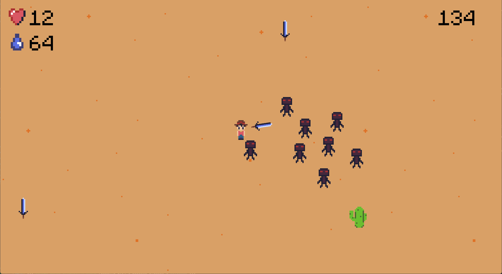

# Epic Desert Game

A small top-down survival game made with JavaFX. Wander a procedurally generated desert,
fend off enemies with your sword, and drink from cacti before your hydration runs out.



## Gameplay

- Enemies will attack you. Find a sword to fend them off!
- The desert is dry and your hydration will decrease. Find cacti to drink from.
- When your hydration is high enough, you will recover health.

> [!NOTE]
> The game is not balanced at all and you will die rather quickly.

## Controls

| Action      | Input                 |
| ----------- | --------------------- |
| Move        | `WASD` / arrow keys   |
| Aim         | Mouse                 |
| Stab        | Left click            |
| Interact    | `E`                   |

## Requirements

- [Java 21 or newer](https://adoptium.net/)

## Play

Grab the jar for your system from the [latest release](../../releases/latest) —
`epicgame-windows.jar`, `epicgame-linux.jar` or `epicgame-macos-arm64.jar` — and run it:

```
java -jar epicgame-windows.jar
```

## Build from source

```
./mvnw package      # builds the runnable jar into target/
./mvnw javafx:run   # or launch it straight from the checkout
```

`JAVA_HOME` must point at a JDK 21 or newer.

## Settings

Put a `settings.yaml` next to the jar to override any entry from
[defaults.yaml](src/main/resources/config/defaults.yaml) — only the keys you list are changed:

```yaml
resolution: [1920, 1080]
playerSpeed: 6
```

Your highscore is stored in `data.txt`, also next to the jar.

## License

[MIT](LICENSE)
